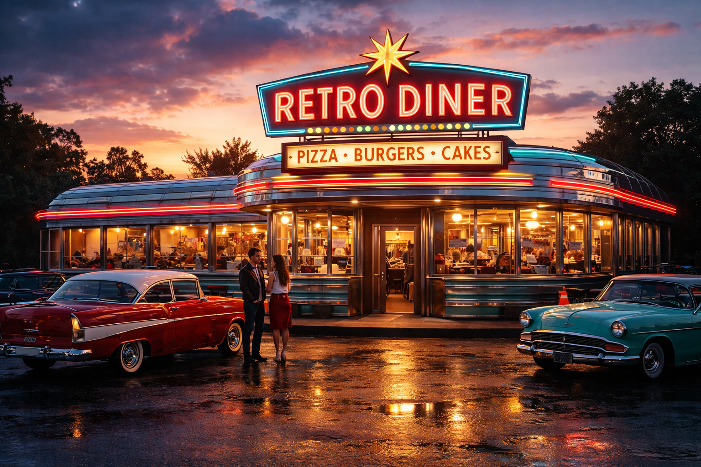

<div align="center">

# ★ THE RETRO DINER ★

### 🍔 Authentic Recipes Since 1955 🍕



[](https://rebelwithoutacause.github.io/Side-Projects/THE-RETRO-DINER/)
[](https://developer.mozilla.org/en-US/docs/Web/HTML)
[](https://developer.mozilla.org/en-US/docs/Web/CSS)
[](https://developer.mozilla.org/en-US/docs/Web/JavaScript)

**A vintage-styled recipe website featuring classic American diner favorites from burgers and pizzas to delicious cakes. Built with a nostalgic 1950s aesthetic and interactive recipe browsing.**

---

</div>

## 👤 Author

**Created by [@rebelwithoutacause](https://github.com/rebelwithoutacause) + Claude Code assistant**

This entire application - from concept to code to design - was created by me as a personal side project.

## 🍔 Features

- **Interactive Navigation**: Dropdown menus for three main categories (Pizza, Burgers, Cakes)
- **Recipe Collection**: 18+ authentic recipes with detailed instructions
- **Retro Design**: Classic 1950s diner aesthetic with vintage styling
- **Responsive Layout**: Clean, organized recipe cards with images
- **Detailed Recipes**: Each recipe includes:
  - Preparation and cooking times
  - Complete ingredient lists
  - Step-by-step instructions
  - High-quality food photography

## 📋 Recipe Categories

### 🍕 Pizza
- Classic Margherita Pizza
- Pepperoni Pizza
- BBQ Chicken Pizza
- Supreme Pizza
- Meat Lovers Pizza
- White Pizza

### 🍔 Burgers
- Classic Beef Burger
- Double Cheeseburger Deluxe
- BBQ Bacon Burger
- Spicy Sriracha Burger
- Pepper Jack Jalapeño Burger
- Turkey Burger

### 🍰 Cakes
- Chocolate Layer Cake
- Classic Vanilla Cake
- Red Velvet Cake
- Coconut Cake
- Hazelnut Cake
- Carolina Reaper Cake (for the brave!)

## 🚀 Getting Started

### Prerequisites
- A modern web browser (Chrome, Firefox, Safari, Edge)
- No additional dependencies required

### Installation

1. Clone this repository:
```bash
git clone https://github.com/rebelwithoutacause/Side-Projects.git
cd Side-Projects/THE-RETRO-DINER
```

2. Open `index.html` in your web browser

That's it! No build process or server required.

## 📁 Project Structure

```
THE-RETRO-DINER/
├── index.html          # Main HTML file
├── styles.css          # Retro-themed styling
├── script.js           # Recipe data and interactivity
├── HomePage/           # Homepage images
├── Burgers/           # Burger recipe images
├── Pizza/             # Pizza recipe images
└── Cakes/             # Cake recipe images
```

## 🎨 Design

The website features a vintage 1950s diner aesthetic with:
- Classic color scheme (cream, red, black)
- Retro typography and decorative elements
- Checkered patterns and vintage borders
- Neon-style text effects
- Nostalgic "Since 1955" branding

## 💻 Technologies Used

- **HTML5**: Semantic markup
- **CSS3**: Custom styling with vintage design elements
- **Vanilla JavaScript**: Dynamic recipe rendering and navigation

## 🤝 Contributing

Feel free to fork this project and add your own recipes or improvements!

## 📝 License

This project is open source and available for personal and educational use.

## 👨‍🍳 About

THE RETRO DINER is a tribute to classic American diner cuisine, bringing timeless recipes to the modern web with a nostalgic twist. This project showcases classic American diner recipes with a vintage aesthetic.

---

**★★★ SATISFACTION GUARANTEED ★★★**

*© 1955-2025 The Retro Diner | Home Cooking Excellence*
